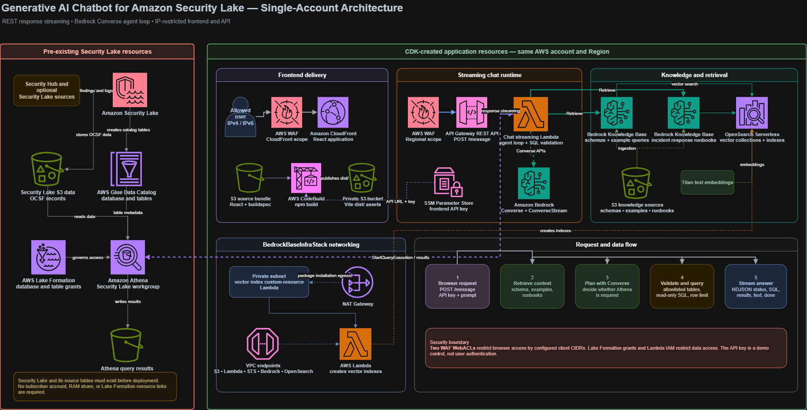

# Generative AI Chatbot for Amazon Security Lake

This repository is a modernized fork of the AWS sample [sample-generative-ai-chatbot-for-amazon-security-lake](https://github.com/aws-samples/sample-generative-ai-chatbot-for-amazon-security-lake/tree/main). The original sample used a multi-account Security Lake subscriber architecture, Bedrock Agents Classic, and a WebSocket-based frontend/backend path. This fork has been updated for a single AWS account and a modern REST API streaming chatbot architecture.

The deployed application provides a React chat UI for asking questions about Amazon Security Lake data. The backend retrieves table schema, example query, and runbook context from Amazon Bedrock Knowledge Bases, uses Amazon Bedrock Converse APIs to plan and generate responses, validates generated SQL, and runs approved read-only queries against Athena.

For a detailed list of changes from the original AWS sample, see [MODERNIZATION_NOTES.md](MODERNIZATION_NOTES.md).

## What This Fork Changes

- Uses a single AWS account instead of a separate Security Lake account and subscriber account.
- Removes the original Resource Access Manager and Lake Formation resource-linking workflow.
- Replaces Bedrock Agents Classic with an application-owned Lambda agent loop using Bedrock Converse and ConverseStream.
- Replaces WebSocket API integration with a REST API `POST /message` endpoint using Lambda response streaming.
- Restricts the CloudFront frontend and API Gateway REST API with AWS WAF allowlists for configured IPv4 and optional IPv6 client CIDRs.
- Creates two Bedrock Knowledge Bases backed by OpenSearch Serverless:
  - table schemas and example queries
  - incident response runbooks
- Grants the backend Lambda Lake Formation permissions to the configured same-account Security Lake tables.
- Adds SQL validation and Security Lake table allowlisting before Athena queries are executed.
- Adds a helper script to generate Knowledge Base table schema JSON files from Glue metadata.

## Prerequisites

Before deploying this stack, complete these items in the same AWS account and region where you will deploy the app:

1. Enable Amazon Security Lake.
2. Enable the Security Lake sources you want the chatbot to query.
3. Confirm that the Security Lake Glue database exists. The default expected database name is:

   ```text
   amazon_security_lake_glue_db_us_east_1
   ```

4. Confirm that each table listed in `securityLakeTableNames` exists in the Security Lake Glue database.
5. Enable access to the Bedrock model or inference profile configured in `bedrockModelId`.
6. Make sure the deploying principal has enough IAM, Glue, Lake Formation, S3, KMS, Lambda, API Gateway, WAF, CloudFront, Athena, OpenSearch Serverless, Bedrock, CodeBuild, EC2, and CloudFormation permissions.
7. Configure `allowedClientIpv4Cidr` and, if needed, `allowedClientIpv6Cidr` before deployment. The frontend and API are intentionally blocked for all other client IPs.

This CDK app does not create Security Lake, Security Hub, or Security Lake source tables.

## Cost Notes

This stack creates resources that can incur cost, including OpenSearch Serverless collections, Bedrock Knowledge Bases, Bedrock model invocations, Lambda, API Gateway, CloudFront, WAF, CodeBuild, NAT Gateway, VPC endpoints, S3, KMS, CloudWatch logs, and Athena queries.

OpenSearch Serverless and NAT Gateway can incur ongoing charges while deployed. Destroy the stacks when you are finished testing.

## Solution Architecture



1. Security Lake, Glue, Lake Formation, Athena, the chatbot backend, Knowledge Bases, OpenSearch Serverless, and frontend hosting live in the same AWS account.
2. Security Lake writes normalized OCSF data into S3 and exposes it through Glue tables.
3. Lake Formation controls access to the Security Lake database and configured tables.
4. Bedrock Knowledge Bases index local table schema files, example queries, and runbook documents from an S3 source bucket.
5. A React app is built by CodeBuild, published to a private S3 bucket, and served through CloudFront.
6. CloudFront and API Gateway are protected by WAF IP allowlists.
7. The React app calls `POST /message` on API Gateway. API Gateway invokes a streaming Lambda integration.
8. The Lambda retrieves Knowledge Base context, plans with Bedrock Converse, validates SQL, queries Athena, and streams newline-delimited response events back to the browser.

## Configure CDK Context

Update `cdk.context.json` before deploying. Do not commit a personal context file with real account IDs, public IP addresses, or cached CDK lookup values.

Example:

```json
{
  "securityLakeRegion": "us-east-1",
  "securityLakeDatabaseName": "amazon_security_lake_glue_db_us_east_1",
  "allowedClientIpv4Cidr": "YOUR_PUBLIC_IPV4/32",
  "allowedClientIpv6Cidr": "YOUR_PUBLIC_IPV6/128",
  "bedrockModelId": "YOUR_BEDROCK_MODEL",
  "athenaWorkgroupName": "primary",
  "maxAthenaRows": 100,
  "maxAthenaWaitSeconds": 45,
  "securityLakeTableNames": [
    "amazon_security_lake_table_us_east_1_sh_findings_2_0",
    "amazon_security_lake_table_us_east_1_vpc_flow_2_0"
  ]
}
```

Context values:

- `securityLakeRegion`: Region where Security Lake, Athena, and the app are deployed.
- `securityLakeDatabaseName`: Existing Security Lake Glue database name.
- `securityLakeTableNames`: Security Lake tables the Lambda may query. Generated SQL is blocked if it references tables outside this list.
- `allowedClientIpv4Cidr`: IPv4 CIDR allowed through CloudFront and API Gateway WAF rules.
- `allowedClientIpv6Cidr`: Optional IPv6 CIDR allowed through CloudFront and API Gateway WAF rules.
- `bedrockModelId`: Bedrock model ID, inference profile ID, or model ARN used by the Lambda agent loop.
- `athenaWorkgroupName`: Athena workgroup used for Security Lake queries.
- `maxAthenaRows`: Maximum rows returned from Athena to the model and UI.
- `maxAthenaWaitSeconds`: Maximum time the Lambda waits for an Athena query to complete.

## Table Schema Files

Knowledge Base schema files live in:

```text
lib/bedrock/kb_source_data/table_schema
```

The configured table list should match your account. You can regenerate schema JSON files from Glue:

```powershell
python -m pip install boto3
npm run generate:security-lake-schemas -- --prune
```

The script reads `securityLakeRegion`, `securityLakeDatabaseName`, and `securityLakeTableNames` from `cdk.context.json` by default.

Example queries live in:

```text
lib/bedrock/kb_source_data/example_queries
```

Runbooks live in:

```text
lib/bedrock/kb_source_data/runbooks
```

## Deploy with CDK

Install dependencies and build:

```powershell
npm install
npm run build
```

Bootstrap your account and region if needed:

```powershell
npx cdk bootstrap aws://<account-id>/<region>
```

Deploy all stacks:

```powershell
npx cdk deploy --all
```

Use `npx cdk` instead of a globally installed `cdk` command. This keeps the CDK CLI aligned with the project dependency versions.

The app deploys three stacks:

- `BedrockBaseInfraStack`
- `BedrockAppStack`
- `FrontendAppStack`

The `FrontendAppStack` output includes:

```text
ReactAppUrl
```

CodeBuild runs after the frontend stack reaches `CREATE_COMPLETE` or `UPDATE_COMPLETE`. The CloudFront URL may take several minutes to serve the built app.

## What the Stacks Create

### BedrockBaseInfraStack

- S3 bucket for Knowledge Base source documents.
- S3 bucket for access logs.
- Upload of local Knowledge Base source files to S3.
- VPC, private subnet, public subnet, NAT Gateway, security group, and VPC endpoints.
- OpenSearch Serverless vector collections for schemas/example queries and runbooks.
- Lambda-backed custom resources that create the OpenSearch vector indexes.
- IAM role used by Bedrock Knowledge Bases.

### BedrockAppStack

- Bedrock Knowledge Base for table schemas and example queries.
- Bedrock Knowledge Base for runbooks.
- Bedrock S3 data sources for `table_schema/`, `example_queries/`, and `runbooks/`.
- Stack outputs for the Knowledge Base IDs.

### FrontendAppStack

- Node.js Lambda that owns the chatbot agent loop.
- REST API Gateway endpoint at `POST /message` with Lambda response streaming.
- API key stored in SSM Parameter Store and injected into the React build.
- WAF WebACL for API Gateway with client IP allowlisting.
- Lake Formation database/table permissions for the backend Lambda.
- React source deployment to S3.
- CodeBuild project that builds the Vite app.
- Private S3 bucket for built frontend assets.
- CloudFront distribution with Origin Access Control.
- WAF WebACL for CloudFront with client IP allowlisting.

## What the Stacks Do Not Create

- Amazon Security Lake.
- Security Lake source configuration.
- Security Lake Glue database or tables.
- Cross-account RAM resource shares.
- Lake Formation resource links.
- Bedrock Agents Classic.
- WebSocket APIs.
- Cognito authentication.

## Post-Deployment Steps

### 1. Start Knowledge Base Ingestion Jobs

The CDK stack creates Knowledge Bases and data sources, but Bedrock does not automatically ingest the data sources.

After deployment, go to the Bedrock console and start ingestion jobs for:

- `gen-ai-sec-lake-table-schema`
  - `table_schema/`
  - `example_queries/`
- `gen-ai-sec-lake-runbooks`
  - `runbooks/`

Wait for ingestion to complete before relying on schema or runbook retrieval in the app.

### 2. Open the App

Open the `ReactAppUrl` CloudFormation output from `FrontendAppStack`.

If you receive a WAF block or the page does not load, verify that `allowedClientIpv4Cidr` and `allowedClientIpv6Cidr` match the IP address your browser is using.

### 3. Test a Query

Start with direct questions, such as:

```text
What Security Lake tables can you use?
```

Then test data-backed questions, such as:

```text
Are there any recent Security Hub findings?
```

The UI displays generated SQL, Athena query results, status messages, and the streamed final answer.

## Chat Backend Behavior

The backend Lambda performs these steps for each user message:

1. Retrieves relevant schema/example-query context from the table schema Knowledge Base.
2. Retrieves relevant incident response context from the runbooks Knowledge Base.
3. Uses Bedrock Converse to decide whether an Athena query is needed.
4. Validates generated SQL before execution.
5. Runs approved read-only SQL with Athena.
6. Streams the final response with Bedrock ConverseStream.

SQL validation enforces:

- Only `SELECT` or `WITH` statements.
- One SQL statement at a time.
- No destructive or administrative keywords.
- At least one configured Security Lake table reference.
- No references to tables outside `securityLakeTableNames`.
- Automatic `LIMIT` injection when the query does not include a limit.

## Troubleshooting

### Blank CloudFront Page or Stale Assets

Wait for the CodeBuild project to finish and confirm the `dist/` files are present in the frontend S3 bucket. If CloudFront cached an older object, create an invalidation for `/*`.

### WAF Blocks

Both the frontend CloudFront distribution and the API Gateway stage have WAF IP allowlists. If your browser uses IPv6, configure `allowedClientIpv6Cidr` as well as `allowedClientIpv4Cidr`.

### Knowledge Base Returns No Context

Confirm that ingestion jobs completed for all data sources. Knowledge Base creation alone is not enough; documents must be ingested.

### Athena or Glue Permission Errors

Verify:

- `securityLakeDatabaseName` is correct.
- Every table in `securityLakeTableNames` exists.
- The deploying principal could create `AWS::LakeFormation::PrincipalPermissions`.
- The backend Lambda role has Lake Formation `DESCRIBE` and `SELECT` on the configured tables.

### Bedrock Access Errors

Verify:

- `bedrockModelId` is available in your account.
- Model access has been enabled where required.
- The selected model supports the Converse APIs.

## Cleanup

When finished, destroy the stacks:

```powershell
npx cdk destroy --all
```

If deletion fails because an S3 bucket is not empty, empty the generated buckets and retry the destroy.

## Security

See [CONTRIBUTING](CONTRIBUTING.md#security-issue-notifications) for more information.

## License

This library is licensed under the MIT-0 License. See the [LICENSE](LICENSE) file.
